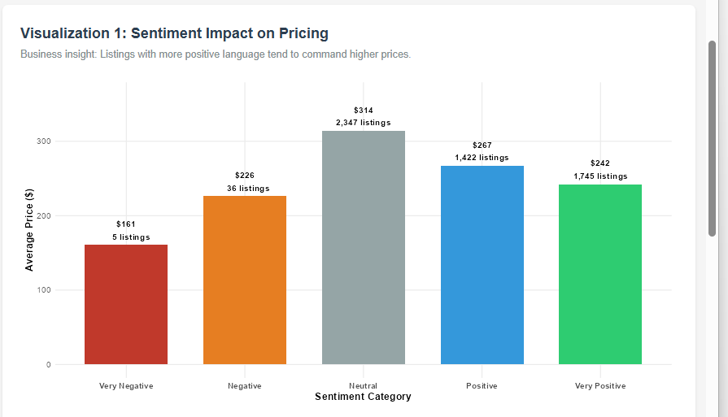
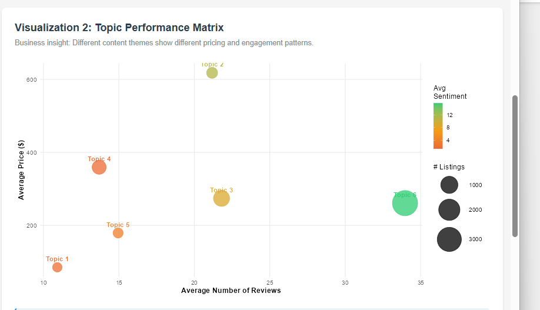
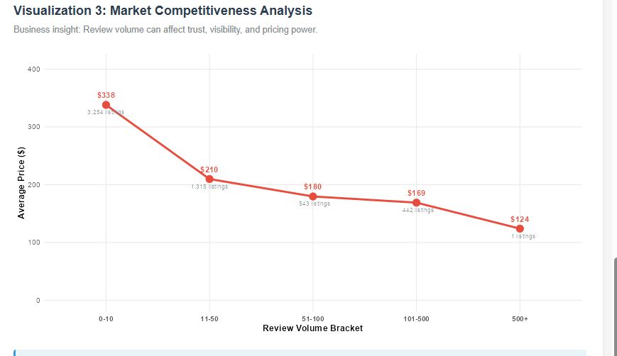
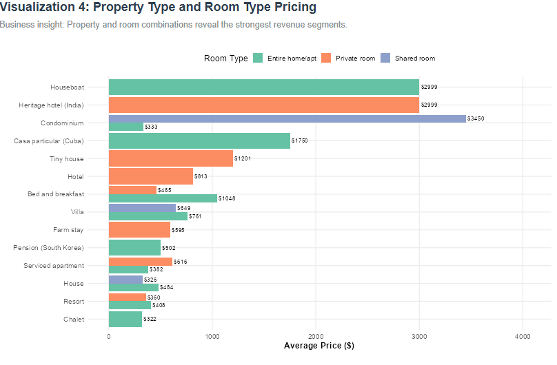
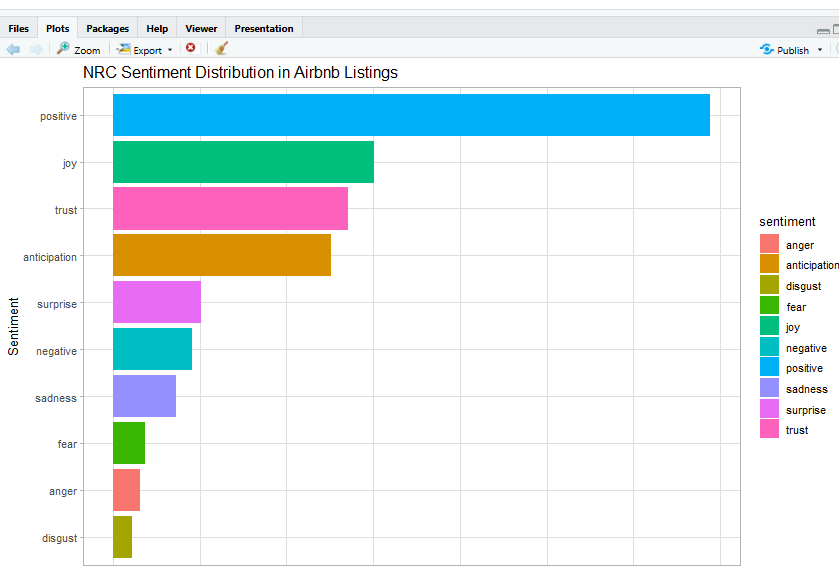
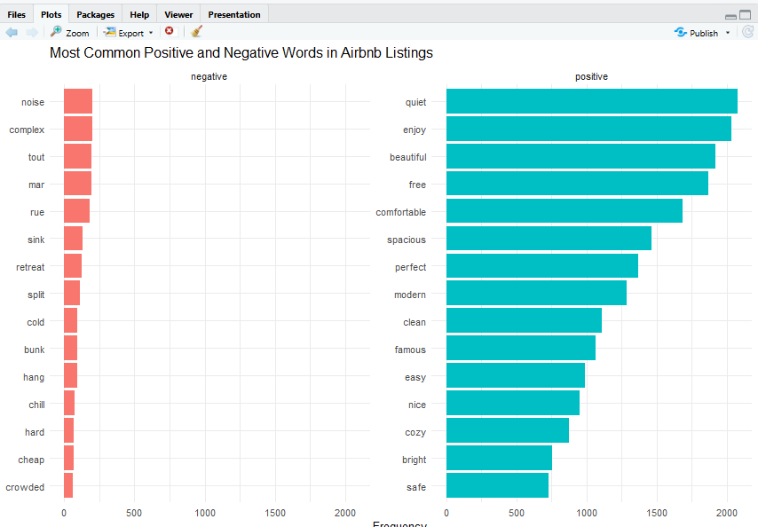
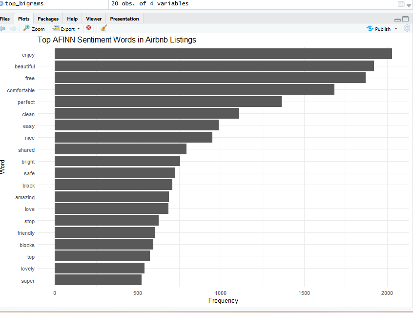
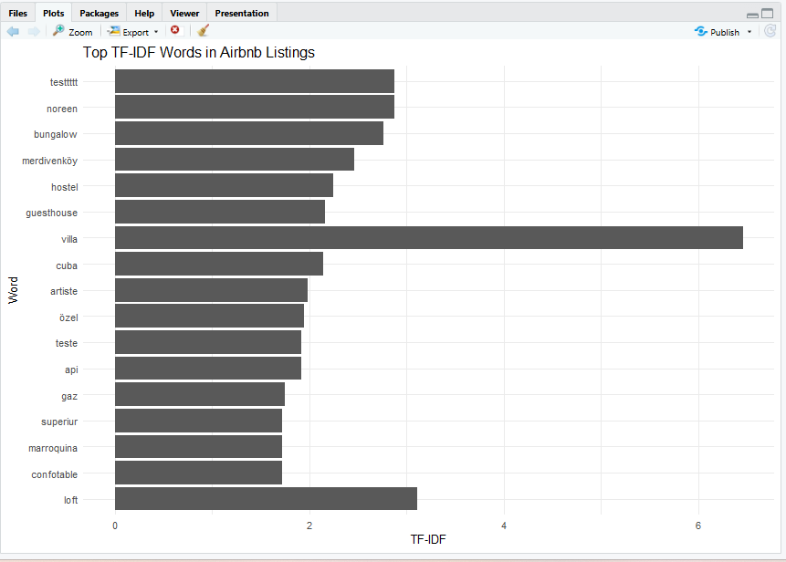
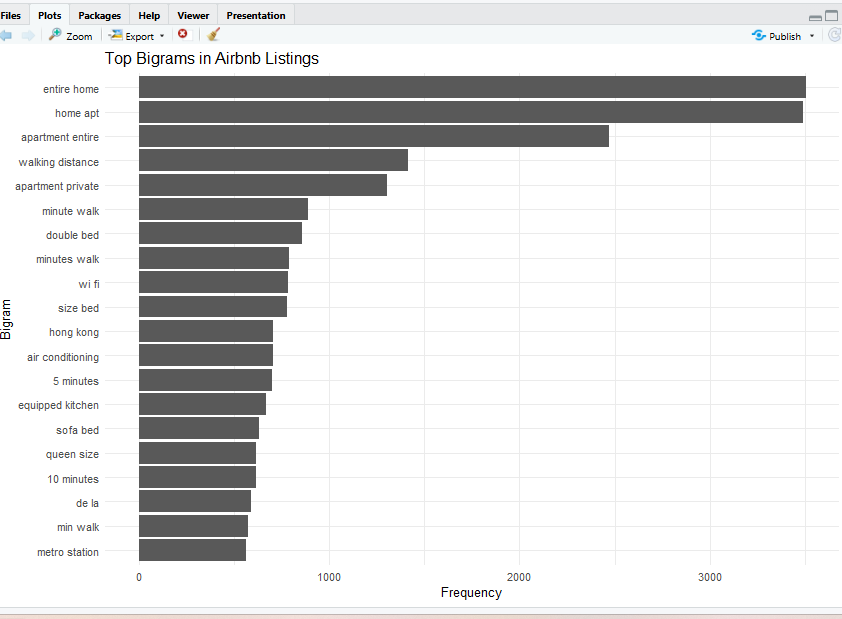

# Airbnb Text Analytics — Turning Listing Descriptions into Pricing Strategy

> Can the **words** a host writes predict what they can charge? This project mines
> the text of **5,000+ Airbnb listings** to find out — combining sentiment
> analysis, TF-IDF, and topic modeling into an interactive **R Shiny** dashboard
> that translates language into pricing and revenue strategy.


**Author:** Valentine Dube · MSc Business Analytics
**Course:** Business Analysis with Unstructured Data — Data Visualization & Text Analytics

---

## 📊 Dashboard at a glance

Four decision-support visuals from the R Shiny dashboard:

| | |
|---|---|
| **1 · Sentiment → Pricing** <br> Listings with more positive language tend to command higher prices. <br> | **2 · Topic Performance Matrix** <br> Different content themes show different pricing & engagement patterns. <br> |
| **3 · Market Competitiveness** <br> Review volume shapes trust, visibility, and pricing power. <br> | **4 · Property & Room Pricing** <br> Property/room combinations reveal the strongest revenue segments. <br> |

---

## 🔍 The problem

Airbnb hosts write descriptions by instinct, with little sense of how wording
affects bookings or price. Treating each listing's text as data, this project
asks: **which language patterns are associated with higher prices, stronger
engagement, and better review performance — and how can hosts act on that?**

## 🧠 Approach

Listing text is pulled live from MongoDB and run through four text-mining
frameworks:

| Framework | Technique | Question it answers |
|-----------|-----------|---------------------|
| **Sentiment analysis** | NRC · BING · AFINN lexicons | What emotions do hosts convey, and does positive language track with price? |
| **TF-IDF + bigrams** | Term weighting & n-grams | Which distinctive features set high-performing listings apart? |
| **Topic modeling** | LDA (k = 6) | What themes exist across listings, and which command premiums? |
| **Dashboard** | R Shiny | Interactive KPIs, filters, and four business-facing visuals |

## 💡 Key findings

- **Language correlates with price** — sentiment and pricing move together
  (correlation **r ≈ 0.52**); more positive, vivid, trust-building descriptions
  are associated with higher asking prices.
- **Generic copy leaves money on the table** — ~70% of listings lean on generic
  words ("nice", "comfortable"); distinctive terms surfaced by TF-IDF (*villa,
  loft, guesthouse, bungalow*) align with stronger engagement.
- **Theme matters** — LDA splits the market into ~6 balanced themes (urban,
  beach, apartment living…); location/experience themes command **20–30%**
  pricing premiums.
- **Reviews have a sweet spot** — credibility and pricing power peak in the
  **50–100 review** band; very high review counts trend toward commoditization.
- **Segment, don't generalize** — entire-home vs shared-room configurations
  drive multiple-times variance in price; positioning beats blanket competition.

Full write-up: [`report/Airbnb_Report_Valentine_Dube.pdf`](report/Airbnb_Report_Valentine_Dube.pdf)

<details>
<summary><b>📈 Underlying text-analysis charts (click to expand)</b></summary>

<br>

**NRC emotion distribution** — positive emotions (joy, trust, anticipation) dominate.


**Most common positive vs negative words (BING)**


**Top AFINN sentiment-scored words**


**Top TF-IDF (most distinctive) words** — *villa, loft, guesthouse* stand out.


**Top bigrams** — common two-word phrases across descriptions.


</details>

---

## 🛠️ Skills demonstrated

`R` · `Text Mining / NLP` · `Sentiment Analysis` · `Topic Modeling (LDA)` ·
`TF-IDF` · `MongoDB (NoSQL)` · `Data Wrangling (dplyr / tidyr)` ·
`Data Visualization (ggplot2)` · `Interactive Dashboards (Shiny)` ·
`Translating analysis into business recommendations`

## 📁 Project structure

```
airbnb-text-analytics/
├── R/
│   └── airbnb_text_analytics.R   # full pipeline: Mongo → sentiment → TF-IDF → LDA → Shiny
├── report/
│   ├── Airbnb_Report_Valentine_Dube.pdf
│   └── Appendix_Text_Analyses_and_RShiny_visuals.pdf
├── docs/images/                  # dashboard & analysis visuals
├── .Renviron.example             # template for the MongoDB connection string
├── .gitignore
└── README.md
```

## 🚀 Run it yourself

**1. Prerequisites** — R (4.x) and a MongoDB Atlas cluster with the
`sample_airbnb` sample dataset loaded.

**2. Configure the connection** (credentials are never stored in code):

```bash
cp .Renviron.example .Renviron        # then edit .Renviron with your own string
```
```
MONGO_URI=mongodb+srv://<username>:<password>@<cluster-host>/?appName=Cluster0
```
`.Renviron` is gitignored, so credentials stay local. Restart R afterward.

**3. Install packages and run:**

```r
install.packages(c("mongolite", "tidyverse", "tidytext", "textdata",
                   "topicmodels", "widyr", "igraph", "ggraph", "wordcloud", "shiny"))

source("R/airbnb_text_analytics.R")   # connects to Mongo, runs analyses, launches the dashboard
```

> The dataset lives in MongoDB and is fetched at runtime — no data is bundled in
> this repo.

## 🧰 Tech stack

`R` · `mongolite` · `tidytext` · `topicmodels` · `dplyr` / `tidyr` · `ggplot2` · `shiny`
